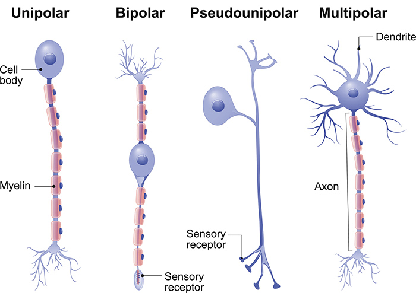

Class 2
=
## The lesson of brain and  Psychology

### Francis Crick says:
```
You, your joys and your sorrows, your memories and your ambitions, your sense of personal identity and free will are in fact no more than the behavior of a vast assembly of nerve cells and their associated molecules. 

As Lewis Carroll's Alice might have phrased it, "you're nothing but a pack of neurons."
```


1. The mind is what the brain does. The mind reflects the workings of the brain. Just like computation reflects the working of the computer.

2. Human's mind are controlled by human's brain. Although It seems so ridiculous, but that's scientifically proved. 

3. There are three kinds of neurons:
> #### 1.  Sensory neurons
> Sensory neurons are the nerve cells that are activated by sensory input from the environment - for example, when you touch a hot surface with your fingertips, the sensory neurons will be the ones firing and sending off signals to the rest of the nervous system about the information they have received.
>#### 2.   Motor neurons  
>connect to muscles, glands and organs throughout the body. 
>#### 3.   Interneurons
>interneurons are the ones in between - they connect spinal motor and sensory neurons. As well as transferring signals between sensory and motor neurons,  interneurons can also communicate with each other, forming circuits of various complexity. 


4. Neuron works like a gun, it either fire or it doesn't. Which means take it to Computer Science, it's 0 or 1.

5. the way of you controlling your body is not 0 or 1. Sometimes it's gradual and sometimes it's intense.

6. The first one is the number of neurons firing. The second one is the frequency of firing in that something is more intense if it's "bang, bang, bang, bang, bang, bang" then [louder] "bang, bang, bang" and these are two ways through which neurons encode intensity.

7. Alcohol is inhibitory, seems weird,but it inhibits the inhibitory parts of your brain. when your inhibitory parts wants you to controll yourself,Alcohol says "No". If you Ingest too much alcohol it will shut down excitatory parts of your brain and then you fall on the floor and pass out.

8. Do you ever wonder why your brain looks wrinkled? That's because it's all crumpled. If you took out somebody's cortex and flattened it out, it would be two feet square, sort of like a nice--like a rug. 

9. agnosia(失認症) is a disorder which isn't blindness because the person could still see perfectly well. Their eyes are intact but rather what happens in agnosia is they lose the ability to recognize certain things. Sometimes this is described as psychic blindness. 


Please read the spech below, it summarized the main question that you will have during all the lesson.
```
Now, you might find this sort of project in the end to be repellant. You might worry about how this, well, this meshes with humanist values. For instance, when we deal with one another in a legal and a moral setting, we think in terms of free will and responsibility. If we're driving and you cut me off, you chose to do that. It reflects badly on you. If you save a life at risk to your own, you're--you deserve praise. You did something wonderful. It might be hard to mesh this with the conception in which all actions are the result of neurochemical physical processes. It might also be hard to mesh a notion such as the purported intrinsic value of people. And finally, it might be hard to mesh the mechanistic notion of the mind with the idea that people have spiritual value.

Faced with this tension, there are three possibilities. You might choose to reject the scientific conception of the mind. Many people do. You may choose to embrace dualism, reject the idea that the brain is responsible for mental life, and reject the promise of a scientific psychology. Alternatively, you might choose to embrace the scientific worldview and reject all these humanist values. And there are some philosophers and psychologists who do just that, who claim that free will and responsibility and spiritual value and intrinsic value are all illusions; they're pre-scientific notions that get washed away in modern science or you could try to reconcile them. You could try to figure out how to mesh your scientific view of the mind with these humanist values you might want to preserve. And this is an issue which we're going to return to throughout the course. 
```

### References:
[The University Of QueenslandQueensland Brain Institute](https://qbi.uq.edu.au/brain/brain-anatomy/types-neurons)
